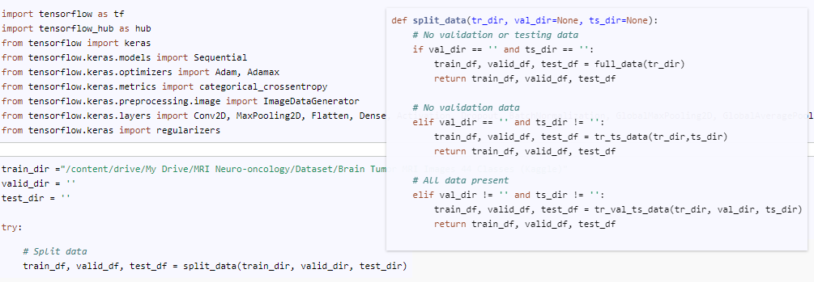

# Mission Statement

Hello! We are twin brothers led by passion and curiosity for data science and machine learning. We are both deeply intrigued by the possibilities of AI and machine learning, and we thought that it would be a great idea to work on a project together. We came up with an idea to build a machine learning model that is interactive and also useful. After some thinking, we both decided that we should come up with ML models that can detect brain tumors in MRI scans as an effort to minimize misdiagnosis.

Brain tumor and its misdiagnosis is unfortunately an issue that has deeply affected our personal lives. Upon research, we discovered that one of the reasons why brain tumors are so dangerous is because of their generic symptoms and mysterious etiologies. These characteristics cause it to be difficult for patients and physicians to pinpoint and diagnose brain tumors until it has already progressed. In fact, it has been studied that physicians missed an opportunity to diagnose head and neck cancer on an earlier imaging exam in about 4% of cases.

With our effort at creating machine learning models to detect brain tumors at earlier stages, we hope to someday save the tears and heartache that misdiagnosis can bring to families. We believe that with the power of AI, we can make a significant impact in the field of medical diagnostics. Our model leverages advanced neural networks, particularly convolutional neural networks (CNNs), to analyze MRI scans and identify potential brain tumors with high accuracy.

We plan on extending our models to other Python ML libraries or even C++ in the future!

However, we must emphasize that these models should merely be used as a point of reference and never as a tool of diagnosis! Please refer to a physician if these results show up as positive. We will NOT be saving your images on any servers and all the analysis will be client-sided, meaning that everything will be run on your personal machine.

## Table of Contents

[1. Goals](#goals)  
[2. Features](#features)   
[3. Development](#development)  
[4. TensorFlow](#tensorflow)  
[4-1. Results](#results)  
[5. PyTorch](#pytorch)  
[6. FastAI](#fastai)

## 
1. Goals
The results of our work have been promising. Our model has shown high accuracy in detecting brain tumors in MRI scans, and we continue to refine it to improve its performance further. We have also made our model interactive, allowing users to input their MRI scans and receive a diagnosis. This feature makes our tool accessible to a broader audience and empowers patients and physicians with a powerful diagnostic aid.

It's still too early to tell, but our ultimate goal is to integrate our model into the healthcare system, where it can be used as a supplementary tool for radiologists and medical professionals. We dare to picture a future where our technology can assist in early detection, leading to timely treatment and improved outcomes for patients.

We are incredibly proud of what we have accomplished so far, but we know that this is just the beginning. There is still much work to be done, and we are committed to continuing our research and development in this field. Our dream is to contribute to the fight against brain tumors and make a lasting impact on the lives of those affected by this devastating condition.

We hope that our story inspires others to explore the possibilities of AI and machine learning in healthcare. Together, we can harness the power of technology to make the world a better place.

## 
2.Features
### Function Overlay

There is an overlay that pops up when you hover over functions in the code section of the website! This saves a lot of space, and it was actually a lot of fun to implement using CSS and the React Syntax Highlighter!

### Prediction Board

A prediction bar graph shows up after the analysis of each image! This is a tensorboard-like feature that lets the user visualize the model and it also adds to the interactivity!

## 
3. Development

We chose to start with TensorFlow first because it's the machine learning library that we are both most familiar with. We decided to use transfer learning of pretrained models after consulting Dr. Roberto Bonelli (Lowy Medical) about it. It turned out to be a great choice because we saved a lot of time and resources while training our models using Google Colab and Kaggle.

Initially, we were thinking about using the newly updated ResNet50, but ultimately decided to use the EfficientNet model because it was lighter weight and much faster while training. Since we were only starting with a prototype, we judged that it would be sufficient for now. You can check out our source code in the "Code" section! But here are the results to our model.

## 
4. TensorFlow
### Why EfficientNet?
Initially, we were thinking about using the newly updated ResNet50, but ultimately decided to use the EfficientNet model because it was lighter weight and much faster while training. Since we were only starting with a prototype, we judged that it would be sufficent for now. You can check out our source code in the "Code" section! But here are the results to our model.

### Training Layers
ReLU, or the rectified linear unit function, is the best when it comes to computer vision through convolutional neural networks. Not only is it cheaper and faster to compute, it isn't affected by the vanishing gradient problem. Also since the images we are training on are grayscale images, relu function triumphs over sigmoid or tanh functions because it can show extremes, black vs. white, more clearly. Leaky ReLU and parametric ReLU functions might also be fun to experiment with as well. But in our scenario, ReLU looked the be the best option.

Another factor we paid attention to was the filter/kernel sizes of our additional Conv2D layers. While Smaller filter sizes are better for distinguishing in between smaller features like circles and rectangles, larger filter sizes are better for distinguishing in between larger features such as whole objects in an image. In our case scenario, I realized that it may be more important to use smaller filter sizes while implementing some 5,5 filters to avoid overfitting to the training dataset. Dropout layers were also added to prevent overfitting. As a result, the model was able to avoid overfitting and trained up to 16 epochs, where it stopped because it was seeming minimal to no improvements.

## 
4-1. Results

